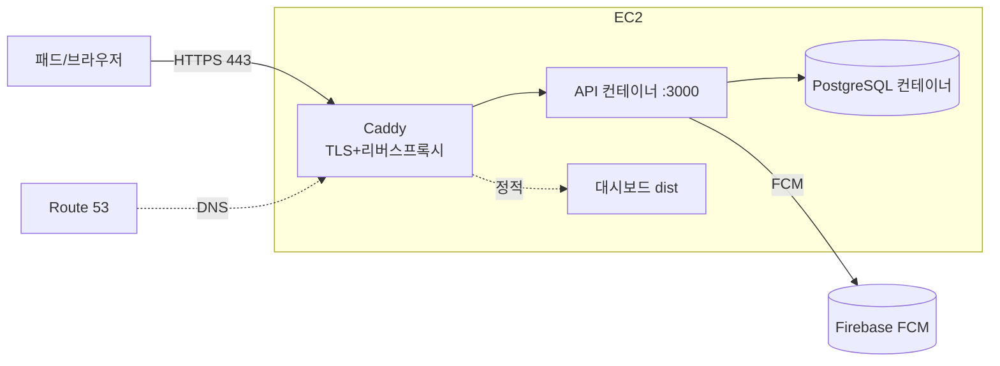
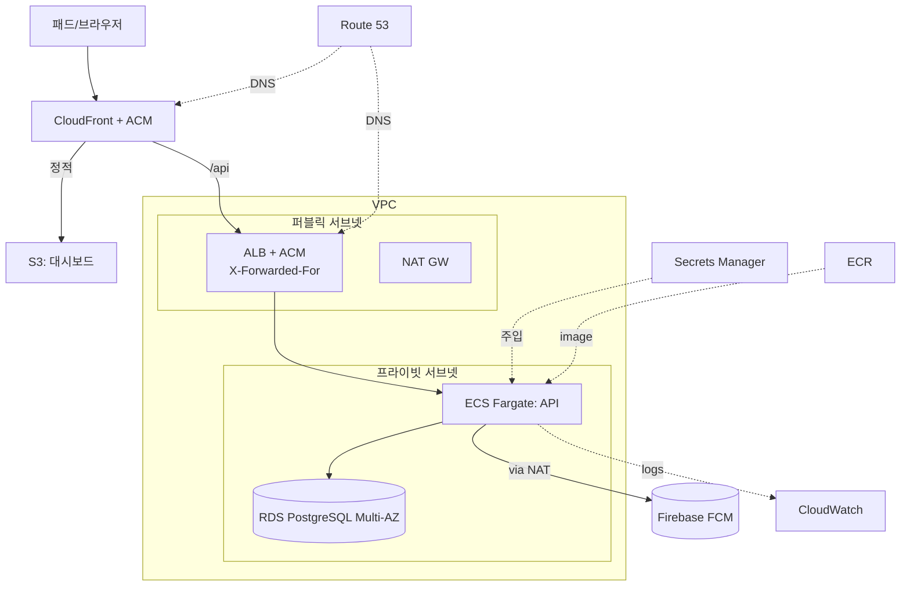

# FindMyPad — AWS 배포 아키텍처

> 패드가 **사외(외부망)에도 존재**할 수 있으므로, API는 **공인 인터넷에 HTTPS로 노출**되어야 한다.
> 이 문서는 필요한 서버/서비스 목록과 두 가지 구성안(최소 EC2 / 권장 매니지드)을 정리한다.

## 시스템 구성요소 (코드 기준)

| 요소 | 기술 | 노출 | 비고 |
|---|---|---|---|
| API 서버 | Fastify(Node≥20, ESM), `dist/server.js` | 공인 HTTPS | REST(패드 보고·enroll + 관리자/직원), node-cron(90일 삭제·무응답 스캔) 내장 |
| DB | PostgreSQL 16 (Drizzle) | 프라이빗 | reports/assets/users/checkouts/ap_map |
| 대시보드 | React+Vite 정적 SPA | 공인 HTTPS | `/api` 는 API로 프록시 |
| 푸시 | Firebase Cloud Messaging(FCM) | 아웃바운드 | 벨/위치요청. 서버가 서비스계정으로 호출(Google, AWS 아님) |

## 외부 패드 전제의 핵심 요건
1. **공인 HTTPS 엔드포인트** — 패드가 LTE/외부 Wi-Fi에서 보고.
2. **실 클라이언트 IP 보존** — 사내/외부망 판정(`CORP_PUBLIC_IPS`)이 `req.ip`(=`X-Forwarded-For` + `TRUST_PROXY=true`)에 의존. LB/CDN 뒤에서 XFF 유지 필수.
3. **FCM 아웃바운드** — 프라이빗 서브넷이면 NAT 필요.
4. 위치는 GPS 없이 AP매핑(실내) + 공인 IP(사내/외부)로 추정. 외부 패드는 대부분 "외부망" 표시(정상).

---

## 구성안 A — 최소(파일럿): 단일 EC2

- **서버 목록**: EC2 1대 + Route 53 도메인 + Firebase(FCM).
- 스택은 `deploy/compose/docker-compose.prod.yml`(api + postgres + caddy). Caddy가 Let's Encrypt로 TLS 자동 발급 + 대시보드 정적 서빙 + `/api` 프록시.
- 장점: 저렴/빠름. 단점: DB 백업·이중화 수동.

## 구성안 B — 권장(운영): 매니지드

### 필요 서버·서비스 목록 (B)

| # | AWS 서비스 | 역할 | 규모(파일럿) |
|---|---|---|---|
| 1 | **ECS Fargate** | API 서버 컨테이너 | 0.5~1 vCPU / 1GB, task 1~2 |
| 2 | **RDS PostgreSQL** (Multi-AZ) | 데이터 저장 | db.t4g.small, gp3 20~50GB, 백업 7d+ |
| 3 | **ALB + ACM** | 공인 HTTPS, XFF 주입, `/health` 헬스체크 | 443 |
| 4 | **Route 53** | DNS(`api.`, `app.`) + ACM 검증 | — |
| 5 | **S3 + CloudFront** | 대시보드 정적 호스팅 | — |
| 6 | **Secrets Manager** | `JWT_SECRET`, DB 비번, Firebase 서비스계정 JSON | — |
| 7 | **NAT Gateway** | 서버→FCM 아웃바운드 | 1 (비용 주의) |
| 8 | **VPC** | 퍼블릭/프라이빗 서브넷·SG | 2AZ |
| 9 | **ECR** | API 도커 이미지 | — |
| 10 | **CloudWatch** | 로그/알람 | — |
| 11 | (선택) **S3** | MaxMind mmdb 파일(`MAXMIND_MMDB_PATH`) | — |

**외부 의존성**: Firebase 프로젝트 + `google-services.json`(앱) + 서비스계정 JSON(서버).

---

## 환경변수 → 저장 위치 (`server/src/config.ts`)

| 변수 | 값 | 저장 |
|---|---|---|
| `DATABASE_URL` | RDS 엔드포인트 | Secrets Manager |
| `JWT_SECRET` | 랜덤 ≥32자 | Secrets Manager |
| `FIREBASE_SERVICE_ACCOUNT` | 서비스계정 JSON(내용) 또는 파일경로 | Secrets Manager |
| `CORP_PUBLIC_IPS` | 사내 egress 공인 IP/CIDR(콤마) | SSM/env(운영자값) |
| `TRUST_PROXY` | `true` (ALB/CloudFront 뒤) | env |
| `CORP_SSIDS`,`RETENTION_DAYS`,`STALE_DAYS`,`PORT` | 정책/포트 | env |
| `MAXMIND_MMDB_PATH` | (선택) mmdb 경로 | env |
| `RUN_MIGRATIONS` | 컨테이너 시작 시 마이그레이션 실행 여부(단일=Y, 멀티태스크=별도 1회) | env |

## 앱/대시보드 측 필수 변경 (배포 전)
- **앱** `AppContainer.kt` `defaultBaseUrl` → `https://api.example.com/` (현재 `127.0.0.1:3000` 하드코딩).
- **앱** network-security-config → HTTPS. knox flavor는 cleartext 불가.
- **대시보드** `VITE_API_BASE_URL` → API 도메인. S3/CloudFront 배포.

## 이 디렉터리의 산출물
- `Dockerfile` / `docker-entrypoint.sh` — API 서버 컨테이너(구성 A·B 공통).
- `compose/` — 구성 A(단일 EC2): `docker-compose.prod.yml` + `Caddyfile` + `.env.prod.example`.
- `terraform/` — 구성 B(권장) IaC 스캐폴드.
